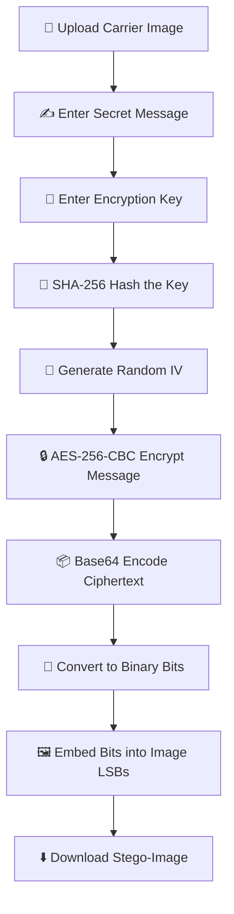
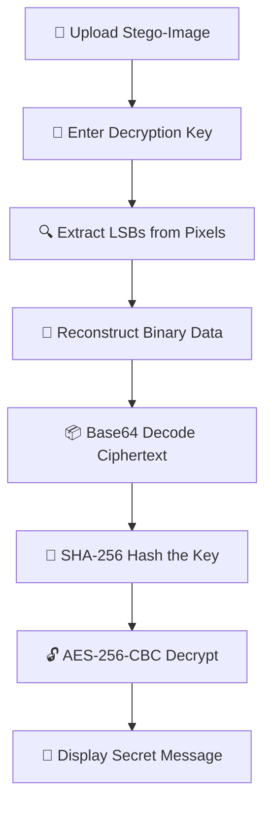

<div align="center">

# 🎨 HiddenPixel - Image Steganography

[](https://www.python.org/)
[](https://flask.palletsprojects.com/)
[](https://developer.mozilla.org/en-US/docs/Web/HTML)
[](https://developer.mozilla.org/en-US/docs/Web/CSS)
[](https://developer.mozilla.org/en-US/docs/Web/JavaScript)
[](https://en.wikipedia.org/wiki/Advanced_Encryption_Standard)
[](LICENSE)
[]()
[](https://github.com/AudiChinmay10/HiddenPixel-Image-Steganography/pulls)

### *"Hide your secrets in plain sight — steganography meets AES-256 encryption"*

[🎬 Demo](#-demo) • [✨ Features](#-features) • [💻 Tech Stack](#-tech-stack) • [🚀 Setup](#-setup--installation) • [📖 Usage](#-usage-guide) • [📡 API Docs](#-api-documentation) • [🔍 How It Works](#-how-it-works) • [🤝 Contributing](#-contributing)

</div>

---

## 📚 Table of Contents

- [🎬 Demo](#-demo)
- [🌟 Overview](#-overview)
- [✨ Features](#-features)
- [💻 Tech Stack](#-tech-stack)
- [📁 Project Structure](#-project-structure)
- [🚀 Setup & Installation](#-setup--installation)
- [📖 Usage Guide](#-usage-guide)
- [📡 API Documentation](#-api-documentation)
- [🔍 How It Works](#-how-it-works)
- [🔒 Security Features](#-security-features)
- [🤝 Contributing](#-contributing)
- [📄 License](#-license)

---

## 🎬 Demo

<div align="center">

> 🎥 **Live Demo coming soon!** Drop an image, embed a secret message, and decode it back — all in your browser.

</div>

<details>
<summary>📸 Click to preview the app UI</summary>
<br>

```
┌─────────────────────────────────────────────────────────────┐
│                  🎨 HiddenPixel                              │
│          Image Steganography & Encryption                    │
├──────────────────────┬──────────────────────────────────────┤
│                      │                                      │
│   [ Upload Image ]   │   ┌──────────────────────────────┐  │
│                      │   │    🖼️  Image Preview          │  │
│  Secret Message:     │   │                              │  │
│  ┌────────────────┐  │   │   (your image appears here)  │  │
│  │                │  │   │                              │  │
│  └────────────────┘  │   └──────────────────────────────┘  │
│                      │                                      │
│  Encryption Key: 🔑  │                                      │
│  ┌────────────────┐  │   [ 🔐 Encode Message ]              │
│  │  ••••••••••••  │  │   [ 🔍 Decode Message ]              │
│  └────────────────┘  │                                      │
│                      │                                      │
├──────────────────────┴──────────────────────────────────────┤
│  🌙 Dark Mode Toggle          🎨 Smooth Animations           │
└─────────────────────────────────────────────────────────────┘
```

**Encoding Flow:**
1. 📂 Upload a carrier image (PNG, JPG, JPEG, BMP)
2. ✍️  Type your secret message
3. 🔑 Enter an encryption key
4. 🚀 Click **Encode** — download your stego-image!

**Decoding Flow:**
1. 📂 Upload the stego-image
2. 🔑 Enter the correct decryption key
3. 🔍 Click **Decode** — your hidden message is revealed!

</details>

---

## 🌟 Overview

**HiddenPixel** is a sophisticated web application that enables you to **hide confidential messages within digital images** using LSB (Least Significant Bit) steganography combined with AES-256 encryption.

**What is Steganography?**
Steganography is the practice of concealing information within another non-secret medium so that the very existence of the message is hidden. Unlike encryption — which makes data unreadable — steganography makes data invisible.

**How HiddenPixel combines both:**
HiddenPixel first **encrypts** your message using AES-256-CBC (with a SHA-256 hashed key and random IV), then **embeds** the encrypted binary data into the least significant bits of the image's pixel values. The result is a visually identical image that secretly carries your ciphertext.

**Use Cases:**
- 🔒 Secure message transmission between parties
- 🤫 Covert communication without arousing suspicion
- 📚 Educational purposes & learning about cryptography
- 🛡️ Data privacy protection and watermarking

---

## ✨ Features

<table>
<tr>
<td width="50%">

**🔐 Advanced Encryption**
- AES-256-CBC encryption
- SHA-256 key hashing
- Secure random IV generation
- Base64 encoding of ciphertext

</td>
<td width="50%">

**🎯 Image Steganography**
- LSB (Least Significant Bit) embedding
- Multi-format support: PNG, JPG, JPEG, BMP
- Lossless encoding & decoding
- Automatic message boundary detection

</td>
</tr>
<tr>
<td width="50%">

**⚡ User-Friendly Interface**
- Fully responsive web design
- Real-time image preview
- Password visibility toggle
- Smooth animations & transitions

</td>
<td width="50%">

**✅ Input Validation**
- File format checking
- Image size validation
- Key strength verification
- Graceful error handling & recovery

</td>
</tr>
<tr>
<td width="50%">

**🌓 Dark / Light Mode**
- One-click theme toggle
- Persistent theme storage (localStorage)
- Comfortable viewing in any environment

</td>
<td width="50%">

**📊 Animations**
- AOS (Animate On Scroll) effects
- Binary text background animation
- Loading spinners
- Smooth scrolling navigation

</td>
</tr>
</table>

---

## 💻 Tech Stack

| Layer | Technologies |
|-------|-------------|
| **Backend** | Python 3.8+, Flask 3.1.0 |
| **Frontend** | HTML5, CSS3, JavaScript (ES6+) |
| **Encryption** | PyCryptodome 3.22.0, Hashlib |
| **Image Processing** | Pillow 11.0.0, NumPy 1.23.5 |
| **Styling** | Bootstrap 5.3, Font Awesome 6.0 |
| **Animations** | AOS (Animate On Scroll) |
| **Deployment** | Gunicorn 23.0.0 |

---

## 📁 Project Structure

```
HiddenPixel-Image-Steganography/
├── app.py                  # Flask backend & steganography logic
├── requirements.txt        # Python dependencies
├── Procfile                # Deployment configuration
├── generated-icon.png      # Application icon
├── static/
│   ├── css/                # Stylesheets
│   ├── js/                 # JavaScript files
│   └── images/             # Static images
└── templates/
    └── *.html              # Jinja2 HTML templates
```

---

## 🚀 Setup & Installation

<details>
<summary>📋 Prerequisites</summary>
<br>

Make sure you have the following installed:

- ✅ **Python 3.8+** — [Download](https://www.python.org/downloads/)
- ✅ **pip** — comes bundled with Python
- ✅ **Git** — [Download](https://git-scm.com/downloads/)

</details>

<details>
<summary>🖥️ Local Installation (Step-by-Step)</summary>
<br>

**1. Clone the repository**
```bash
git clone https://github.com/AudiChinmay10/HiddenPixel-Image-Steganography.git
cd HiddenPixel-Image-Steganography
```

**2. (Optional) Create and activate a virtual environment**
```bash
python -m venv venv
# On Windows:
venv\Scripts\activate
# On macOS/Linux:
source venv/bin/activate
```

**3. Install dependencies**
```bash
pip install -r requirements.txt
```

**4. Run the application**
```bash
python app.py
```

**5. Open in your browser**
```
http://localhost:5000
```

</details>

<details>
<summary>🐳 Docker (Optional)</summary>
<br>

> 🚧 Docker support coming soon! A `Dockerfile` will be added in a future release.

```bash
# Placeholder — Docker build and run commands will go here
docker build -t hiddenpixel .
docker run -p 5000:5000 hiddenpixel
```

</details>

---

## 📖 Usage Guide

### 🔐 Encoding a Message

1. 📂 **Upload a carrier image** — Click *Choose File* and select a PNG, JPG, JPEG, or BMP image.
2. ✍️  **Enter your secret message** — Type the confidential text you want to hide.
3. 🔑 **Enter an encryption key** — Choose a strong password. This key is required to decode later.
4. 🚀 **Click Encode** — The app encrypts your message with AES-256 and embeds it into the image pixels.
5. 💾 **Download the stego-image** — Save the output image. It looks identical to the original but carries your hidden message.

### 🔍 Decoding a Message

1. 📂 **Upload the stego-image** — Select the image that contains the hidden message.
2. 🔑 **Enter the decryption key** — Use the same key that was used during encoding.
3. 🔓 **Click Decode** — The app extracts the binary data from the image's LSBs and decrypts the message.
4. 📜 **View your hidden message** — The original secret text is displayed on screen.

---

## 📡 API Documentation

| Method | Endpoint  | Description                          |
|--------|-----------|--------------------------------------|
| `GET`  | `/`       | Render the home page                 |
| `POST` | `/encode` | Encode a secret message into an image |
| `POST` | `/decode` | Decode a hidden message from an image |

### POST `/encode`

**Request** (multipart/form-data):
```
image   : <image file>   # Carrier image (PNG/JPG/JPEG/BMP)
message : string         # Secret message to hide
key     : string         # Encryption password
```

**Response**: Returns the stego-image file as a download.

```json
// On error:
{ "error": "Description of what went wrong" }
```

### POST `/decode`

**Request** (multipart/form-data):
```
image : <image file>   # Stego-image containing hidden data
key   : string         # Decryption password
```

**Response**:
```json
{ "message": "Your decoded secret message here" }
// On failure:
{ "message": "Invalid decryption key or corrupted data!" }
```

---

## 🔍 How It Works

<details>
<summary>🧩 LSB Steganography Explained</summary>
<br>

Every pixel in a digital image is made up of color channels (e.g., Red, Green, Blue). Each channel is stored as an 8-bit integer (0–255). The **Least Significant Bit (LSB)** is the rightmost bit — changing it causes only a ±1 shift in the color value, which is imperceptible to the human eye.

HiddenPixel replaces the LSB of each color channel with one bit of the encrypted message. A 1000×1000 RGB image has 3,000,000 LSBs available — enough to hide a very long message while keeping the image visually unchanged.

</details>

### 📤 Encoding Flow



### 📥 Decoding Flow



---

## 🔒 Security Features

- 🔐 **AES-256-CBC Encryption** — Industry-standard symmetric encryption with a 256-bit key and Cipher Block Chaining mode.
- 🔑 **SHA-256 Key Hashing** — The user-supplied password is hashed with SHA-256 to produce a fixed 32-byte key, preventing weak-key attacks.
- 🎲 **Random IV (Initialization Vector)** — A cryptographically secure random 16-byte IV is generated for every encode operation, ensuring identical messages produce different ciphertexts.
- 📦 **Base64 Encoding** — The binary ciphertext (including the IV) is Base64-encoded before embedding, ensuring safe transport within pixel data.
- 🚫 **No Server-Side Storage** — Messages and encryption keys are never stored on the server. All processing happens in-memory and the data is discarded after the request completes.

---

## 🤝 Contributing

Contributions are welcome and appreciated! 🎉

1. 🍴 **Fork** the repository
2. 🌿 **Create a feature branch**
   ```bash
   git checkout -b feature/your-amazing-feature
   ```
3. 💻 **Make your changes** and commit them
   ```bash
   git commit -m "feat: add your amazing feature"
   ```
4. 📤 **Push** to your branch
   ```bash
   git push origin feature/your-amazing-feature
   ```
5. 🔁 **Open a Pull Request** targeting `main`

Please follow the existing code style and add relevant tests where applicable. By contributing, you agree to abide by the project's Code of Conduct.

---

## 📄 License

[](LICENSE)

This project is licensed under the **MIT License** — you are free to use, modify, and distribute this software with attribution. See the [LICENSE](LICENSE) file for details.

---

<div align="center">

Made with ❤️ and 🔐 by <a href="https://github.com/AudiChinmay10">AudiChinmay10</a>

⭐ **If you found this project useful, please give it a star!** ⭐

[⬆ Back to Top](#-hiddenpixel---image-steganography)

</div>
